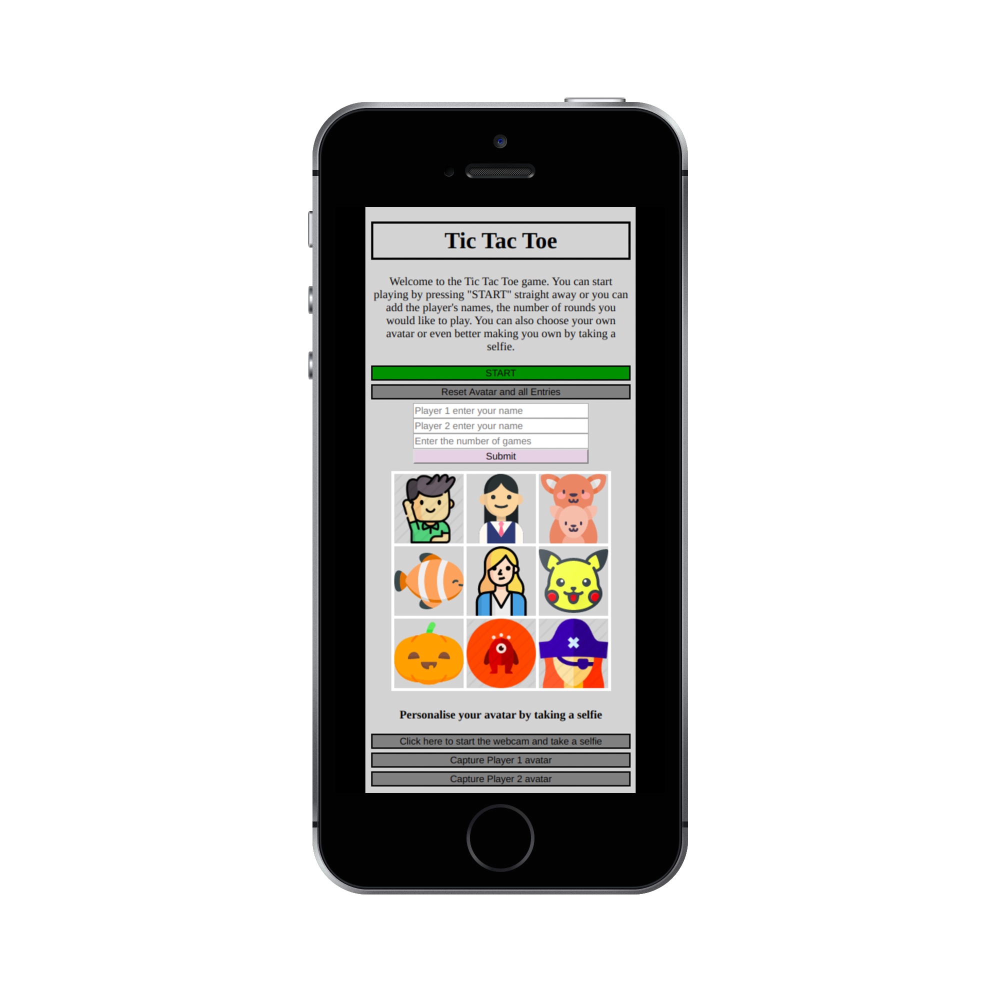

# TIC TAC TOE

Click here to play: https://philippe-tome.github.io/Tic-Tac-Toe-game/

1. [How to Play](#how)
2. [Development](#development)
3. [Problems](#problems)
4. [Challenges](#challenges)
5. [Lessons](#lessons)

## 1. HOW TO PLAY:

If you haven't had a chance to play Tic Tac Toe yet here is a quick description on how to play:

The objective is to get 3 of the same symbol in the same row or column or a diagonal. The first player to achieve this is the winner.

I have made it possible for players to choose their avatars or to even take a selfie to be used as an avatar. To reset your avatar you will need to reset the game first.

Have Fun!

## 2. DEVELOPMENT: 

Technologies Used: Html, CSS, Javascript

Planning: I started to write pseudocode to highlight the minimum features and functions required.

Created quickly my HTML tags just so I could see what I was doing.

Wrote down all the logic in my Javascript file. Started by creating a function to handle all my clicks in the grid. From there I added everything I needed in that function. Once this was written I started to write the rest for Score tracking, Match tracking, display messages, etc...

Once all the game logic was working fine and my code was meeting the minimum requirements set by the teacher I decided to spice it up by exploring other features I could add such as sound effect, video, personalised avatars, etc...

Styling: I was very interested in exploring new things in Javascript and decided to focus most of my time writing the game logic and adding features. I kept the last 4 hours to tidy up everything and have a minimum of design which can be seen by the lack of it.

## 3. PROBLEMS: 

1.  FIXED PROBLEMS:

    - Avatar selection: For the avatar selection I faced few a challenges to make sure that no player could have the same avatar but still give a chance to the second player to choose his/her avatar first. Because of that, I decided to get the players to select which player number they wished to be and then listen for a click on the avatar.
      I also had to make sure that if they did not want an avatar the game would then assign the default cross and circle symbol.

    - Player sound: I first thought of having Players sound effect by default and then I decided to also add a different sound to each avatar. This was a bit challenging to retrieve the avatar ID number and then call the right sound effect for this avatar.
      I also decided to assign default sound effects to personalise avatar.

    - Personalised avatars: I wanted to add this feature so I could learn about how to use the webcam. This feature was probably the most challenging. To save the image somewhere and then being able to assign it to the box where the player clicked was very challenging. I decided to use the "toDataUrl" function to save the image data to a variable and then create an img tag to the clicked box and then assign the src to the data previously saved. When resetting the game I had to clear all of those images from the grid.

2.  PROBLEMS NOT YET SOLVED:

    - Keyboard: I also wanted to add the possibility to play the game by pressing the arrow keys and enter. This would have been a good exercise to learn how to listen to Keyboard keys.

## 4. CHALLENGES: 

Each new features added its amount of bugs with it. Much more than anticipated.

## 5. LESSONS: 

Knowing all the requirements from the beginning is very important.
When I decided to add all the extra features for the fun I realised that I could have done things differently to help for their additions.

The architecture of the logic is very important. I'm glad I decided to split my code with multiple meaningful functions that were giving me some flexibility to add further things into them when needed.
